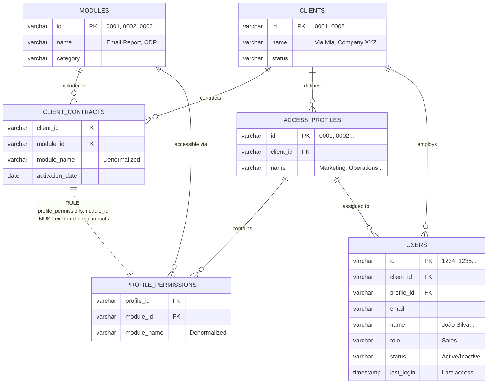

# Technical Specification: SaaS Access Control Architecture

## 1. Executive Summary
This document defines the architecture for the **Contract-Driven Access Control** system. This system is the foundational security layer for our SaaS platform, ensuring that feature access is strictly bounded by client contracts before any user-level permissions are applied.

**Key Objective**: Enforce a "Hard Ceiling" where `User Access <= Client Contract`.

## 2. Core Definitions

| Term | Definition |
| :--- | :--- |
| **Module** | A distinct, sellable feature set (e.g., `email`, `crm`, `analytics`). Identified by a unique `key`. |
| **Client** | An enterprise tenant/account. |
| **Contract Scope** | The set of Modules a Client has purchased. This is the **Maximum Possible Access** for any user in that client. |
| **User Permission** | The set of Modules a specific User is allowed to access. |

## 3. Optimized Data Model

### 3.1 Table: `modules` (Module Catalog)
Complete list of all available modules in the platform.

| id | name | category | description |
|:---|:-----|:---------|:------------|
| 0001 | Email Report | Reports | Email campaign analysis |
| 0002 | SMS Report | Reports | SMS campaign analysis |
| 0003 | WhatsApp Report | Reports | WhatsApp campaign analysis |
| 0004 | CDP | Platform | Customer Data Platform |
| 0005 | Email Sending | Sending | Email sending tool |
| 0006 | SMS Sending | Sending | SMS sending tool |

**Schema:**
```sql
CREATE TABLE modules (
  id VARCHAR(10) PRIMARY KEY,
  name VARCHAR(100) NOT NULL,
  category VARCHAR(50),
  description TEXT
);
```

---

### 3.2 Table: `clients` (Clients/Brands)
Registry of all platform clients.

| id | name | status | contract_date |
|:---|:-----|:-------|:--------------|
| 0001 | Via Mia | Active | 2024-01-15 |
| 0002 | Company XYZ | Active | 2024-03-20 |
| 0003 | Brand ABC | Inactive | 2023-11-10 |

**Schema:**
```sql
CREATE TABLE clients (
  id VARCHAR(10) PRIMARY KEY,
  name VARCHAR(200) NOT NULL,
  status VARCHAR(20) DEFAULT 'Active',
  contract_date DATE
);
```

---

### 3.3 Table: `client_contracts` (Contract = Client Universe)
Defines which modules each client has contracted. **This is the "hard ceiling"**.

| client_id | module_id | module_name | activation_date | expiration_date |
|:----------|:----------|:------------|:----------------|:----------------|
| 0001 | 0001 | Email Report | 2024-01-15 | NULL |
| 0001 | 0002 | SMS Report | 2024-01-15 | NULL |
| 0001 | 0005 | Email Sending | 2024-01-15 | NULL |
| 0002 | 0001 | Email Report | 2024-03-20 | NULL |
| 0002 | 0004 | CDP | 2024-03-20 | NULL |

**Example**: Via Mia (0001) has access to Email Report, SMS Report and Email Sending.

**Note**: The `module_name` field is denormalized for query performance. It's derived from `modules.name` via FK.

**Schema:**
```sql
CREATE TABLE client_contracts (
  client_id VARCHAR(10) NOT NULL,
  module_id VARCHAR(10) NOT NULL,
  module_name VARCHAR(100) NOT NULL, -- Denormalized from modules.name
  activation_date DATE,
  expiration_date DATE,
  PRIMARY KEY (client_id, module_id),
  FOREIGN KEY (client_id) REFERENCES clients(id),
  FOREIGN KEY (module_id) REFERENCES modules(id)
);

CREATE INDEX idx_client_contract ON client_contracts(client_id);
```

---

### 3.4 Table: `access_profiles` (Access Profiles)
Profiles created by the brand to group permissions.

| id | client_id | name | description |
|:---|:----------|:-----|:------------|
| 0001 | 0001 | Marketing | Access to campaign reports |
| 0002 | 0001 | Operations | Access to sending and reports |
| 0003 | 0002 | Analyst | Full access |

**Schema:**
```sql
CREATE TABLE access_profiles (
  id VARCHAR(10) PRIMARY KEY,
  client_id VARCHAR(10) NOT NULL,
  name VARCHAR(100) NOT NULL,
  description TEXT,
  FOREIGN KEY (client_id) REFERENCES clients(id)
);

CREATE INDEX idx_profile_client ON access_profiles(client_id);
```

---

### 3.5 Table: `profile_permissions` (Profile Modules)
Defines which modules each profile can access. **Must be a subset of the contract**.

| profile_id | module_id | module_name |
|:-----------|:----------|:------------|
| 0001 | 0001 | Email Report |
| 0001 | 0002 | SMS Report |
| 0002 | 0001 | Email Report |
| 0002 | 0002 | SMS Report |
| 0002 | 0005 | Email Sending |

**Example**: "Marketing" profile (0001) from Via Mia has access only to reports.

**Note**: The `module_name` field is denormalized for query performance. It's derived from `modules.name` via FK.

**Schema:**
```sql
CREATE TABLE profile_permissions (
  profile_id VARCHAR(10) NOT NULL,
  module_id VARCHAR(10) NOT NULL,
  module_name VARCHAR(100) NOT NULL, -- Denormalized from modules.name
  PRIMARY KEY (profile_id, module_id),
  FOREIGN KEY (profile_id) REFERENCES access_profiles(id),
  FOREIGN KEY (module_id) REFERENCES modules(id)
);

CREATE INDEX idx_profile_perms ON profile_permissions(profile_id);
```

---

### 3.6 Table: `users` (Users)
End users linked to a client and profile.

| id | client_id | profile_id | email | name | role | status | last_login |
|:---|:----------|:-----------|:------|:-----|:-----|:-------|:-----------|
| 1234 | 0001 | 0001 | sellbie@viamia.com.br | João Silva | Sales | Active | 2024-11-25 10:30:00 |
| 1235 | 0001 | 0002 | maria@viamia.com.br | Maria Santos | Manager | Active | 2024-11-24 15:45:00 |
| 1236 | 0002 | 0003 | ana@xyz.com | Ana Costa | Analyst | Active | 2024-11-25 09:15:00 |

**Schema:**
```sql
CREATE TABLE users (
  id VARCHAR(10) PRIMARY KEY,
  client_id VARCHAR(10) NOT NULL,
  profile_id VARCHAR(10),
  email VARCHAR(200) UNIQUE NOT NULL,
  name VARCHAR(200) NOT NULL,
  role VARCHAR(100),
  status VARCHAR(20) DEFAULT 'Active',
  last_login TIMESTAMP, -- Last access timestamp
  FOREIGN KEY (client_id) REFERENCES clients(id),
  FOREIGN KEY (profile_id) REFERENCES access_profiles(id)
);

CREATE INDEX idx_user_client ON users(client_id);
CREATE INDEX idx_user_profile ON users(profile_id);
CREATE INDEX idx_user_last_login ON users(last_login); -- For activity queries
```

---

## 4. Optimized Access Logic

### 4.1 Access Verification Query (1 JOIN only)
```sql
-- Checks if user 1234 can access module 0001
SELECT 
  u.id as user_id,
  u.name as user_name,
  m.id as module_id,
  m.name as module_name,
  CASE 
    WHEN cc.module_id IS NULL THEN 'DENIED - Module not contracted'
    WHEN pp.module_id IS NULL THEN 'DENIED - Profile without permission'
    ELSE 'ALLOWED'
  END as result
FROM users u
LEFT JOIN client_contracts cc 
  ON u.client_id = cc.client_id AND cc.module_id = '0001'
LEFT JOIN profile_permissions pp 
  ON u.profile_id = pp.profile_id AND pp.module_id = '0001'
CROSS JOIN modules m
WHERE u.id = '1234' AND m.id = '0001';
```

### 4.2 Query: List Available Modules for User
```sql
-- Lists all modules that user 1234 can access
SELECT DISTINCT
  m.id,
  m.name,
  m.category
FROM users u
JOIN profile_permissions pp ON u.profile_id = pp.profile_id
JOIN modules m ON pp.module_id = m.id
JOIN client_contracts cc ON u.client_id = cc.client_id AND m.id = cc.module_id
WHERE u.id = '1234' AND u.status = 'Active';
```

---

## 5. Optimized Diagram



---

## 6. Architecture Advantages

✅ **Performance**: Queries with only 1-2 JOINs, using optimized indexes  
✅ **Scalability**: Horizontal structure allows millions of records  
✅ **Clarity**: Numeric IDs facilitate tracking and debugging  
✅ **Security**: 2-layer validation (Contract → Profile)  
✅ **Flexibility**: Easy to add/remove modules from contract or profile
