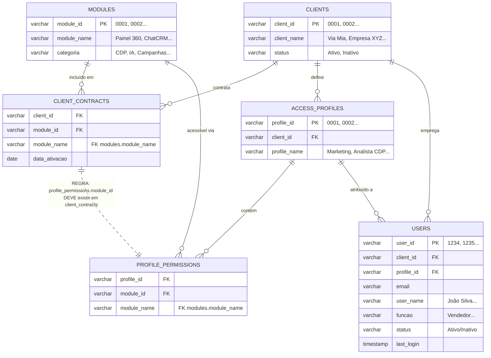

# Especificação Técnica: Arquitetura de Controle de Acesso SaaS

## 1. Resumo Executivo
Este documento define a arquitetura para o sistema de **Controle de Acesso Baseado em Contrato**. Este sistema é a camada de segurança fundamental para nossa plataforma SaaS, garantindo que o acesso a recursos seja estritamente limitado pelos contratos do cliente antes que quaisquer permissões em nível de usuário sejam aplicadas.

**Objetivo Chave**: Impor um "Teto Rígido" (Hard Ceiling) onde `Acesso do Usuário <= Contrato do Cliente`.

## 2. Definições Principais

| Termo | Definição |
| :--- | :--- |
| **Módulo** | Um conjunto de recursos distinto e vendável (ex: `Painel 360`, `Campanhas pontuais`, `ChatCRM`). Identificado por um `module_id` único. |
| **Cliente** | Um locatário/conta empresarial. |
| **Escopo do Contrato** | O conjunto de Módulos que um Cliente comprou. Este é o **Acesso Máximo Possível** para qualquer usuário nesse cliente. |
| **Permissão do Usuário** | O conjunto de Módulos que um Usuário específico tem permissão para acessar. |

## 3. Modelo de Dados Otimizado

### 3.1 Tabela: `modules` (Catálogo de Módulos)
Lista completa de todos os módulos disponíveis na plataforma.

| module_id | module_name | categoria | descricao |
|:---|:-----|:----------|:----------|
| 0001 | Painel 360 | CDP | Visão unificada do cliente |
| 0002 | Indicadores CRM | CDP | Métricas e KPIs de CRM |
| 0003 | Performance Venda | CDP | Análise de performance de vendas |
| 0004 | Indicadores de atendimento | CDP | Métricas de atendimento ao cliente |
| 0005 | Campanhas pontuais | Campanhas Criação | Criação de campanhas únicas |
| 0006 | Jornadas | Campanhas Criação | Automação de jornadas do cliente |
| 0007 | Biblioteca de templates | Campanhas Criação | Repositório de templates |
| 0008 | Meus arquivos html | Campanhas Criação | Gerenciamento de arquivos HTML |
| 0009 | Criar html | Campanhas Criação | Editor de HTML |
| 0010 | Bases salvas | Campanhas Criação | Segmentação de bases |
| 0011 | Relatórios de campanhas | Campanhas Performance | Análise geral de campanhas |
| 0012 | Relatórios de email | Campanhas Performance | Métricas de email marketing |
| 0013 | Relatórios de sms | Campanhas Performance | Métricas de SMS |
| 0014 | Relatórios de whatsapp 1:1 | Campanhas Performance | Métricas WhatsApp individual |
| 0015 | Relatórios de whatsapp oficial | Campanhas Performance | Métricas WhatsApp Business API |
| 0016 | ChatCRM | IA | Assistente virtual com IA |
| 0017 | Propensão de cliente | IA | Predição de comportamento |

**Schema:**
```sql
CREATE TABLE modules (
  module_id VARCHAR(10) PRIMARY KEY,
  module_name VARCHAR(100) NOT NULL,
  categoria VARCHAR(50),
  descricao TEXT
);
```

---

### 3.2 Tabela: `clients` (Clientes/Marcas)
Cadastro de todos os clientes da plataforma.

| client_id | client_name | status | data_contrato |
|:---|:-----|:-------|:--------------|
| 0001 | Via Mia | Ativo | 2024-01-15 |
| 0002 | Empresa XYZ | Ativo | 2024-03-20 |
| 0003 | Marca ABC | Inativo | 2023-11-10 |

**Schema:**
```sql
CREATE TABLE clients (
  client_id VARCHAR(10) PRIMARY KEY,
  client_name VARCHAR(200) NOT NULL,
  status VARCHAR(20) DEFAULT 'Ativo',
  data_contrato DATE
);
```

---

### 3.3 Tabela: `client_contracts` (Contrato = Universo do Cliente)
Define quais módulos cada cliente contratou. **Este é o "teto rígido"**.

| client_id | module_id | module_name | data_ativacao | data_expiracao |
|:----------|:----------|:------------|:--------------|:---------------|
| 0001 | 0001 | Painel 360 | 2024-01-15 | NULL |
| 0001 | 0005 | Campanhas pontuais | 2024-01-15 | NULL |
| 0001 | 0011 | Relatórios de campanhas | 2024-01-15 | NULL |
| 0001 | 0016 | ChatCRM | 2024-01-15 | NULL |
| 0002 | 0001 | Painel 360 | 2024-03-20 | NULL |
| 0002 | 0002 | Indicadores CRM | 2024-03-20 | NULL |
| 0002 | 0012 | Relatórios de email | 2024-03-20 | NULL |

**Exemplo**: Via Mia (0001) tem acesso a módulos de CDP, Campanhas e IA.

**Nota**: O campo `module_name` é desnormalizado para facilitar consultas. É derivado de `modules.module_name` via FK.

**Schema:**
```sql
CREATE TABLE client_contracts (
  client_id VARCHAR(10) NOT NULL,
  module_id VARCHAR(10) NOT NULL,
  module_name VARCHAR(100) NOT NULL, -- FK de modules.module_name
  data_ativacao DATE,
  data_expiracao DATE,
  PRIMARY KEY (client_id, module_id),
  FOREIGN KEY (client_id) REFERENCES clients(client_id),
  FOREIGN KEY (module_id) REFERENCES modules(module_id)
);

CREATE INDEX idx_client_contract ON client_contracts(client_id);
```

---

### 3.4 Tabela: `access_profiles` (Perfis de Acesso)
Perfis criados pela marca para agrupar permissões.

| profile_id | client_id | profile_name | descricao |
|:---|:----------|:-----|:----------|
| 0001 | 0001 | Marketing | Acesso a campanhas e relatórios |
| 0002 | 0001 | Analista CDP | Acesso a dados e indicadores |
| 0003 | 0002 | Gestor Comercial | Acesso completo |

**Schema:**
```sql
CREATE TABLE access_profiles (
  profile_id VARCHAR(10) PRIMARY KEY,
  client_id VARCHAR(10) NOT NULL,
  profile_name VARCHAR(100) NOT NULL,
  descricao TEXT,
  FOREIGN KEY (client_id) REFERENCES clients(client_id)
);

CREATE INDEX idx_profile_client ON access_profiles(client_id);
```

---

### 3.5 Tabela: `profile_permissions` (Módulos do Perfil)
Define quais módulos cada perfil pode acessar. **Deve ser subconjunto do contrato**.

| profile_id | module_id | module_name |
|:-----------|:----------|:------------|
| 0001 | 0005 | Campanhas pontuais |
| 0001 | 0011 | Relatórios de campanhas |
| 0002 | 0001 | Painel 360 |
| 0002 | 0002 | Indicadores CRM |
| 0003 | 0001 | Painel 360 |
| 0003 | 0002 | Indicadores CRM |
| 0003 | 0012 | Relatórios de email |

**Exemplo**: Perfil "Marketing" (0001) da Via Mia tem acesso apenas a campanhas e relatórios.

**Nota**: O campo `module_name` é desnormalizado para facilitar consultas. É derivado de `modules.module_name` via FK.

**Schema:**
```sql
CREATE TABLE profile_permissions (
  profile_id VARCHAR(10) NOT NULL,
  module_id VARCHAR(10) NOT NULL,
  module_name VARCHAR(100) NOT NULL, -- FK de modules.module_name
  PRIMARY KEY (profile_id, module_id),
  FOREIGN KEY (profile_id) REFERENCES access_profiles(profile_id),
  FOREIGN KEY (module_id) REFERENCES modules(module_id)
);

CREATE INDEX idx_profile_perms ON profile_permissions(profile_id);
```

---

### 3.6 Tabela: `users` (Usuários)
Usuários finais vinculados a um cliente e perfil.

| user_id | client_id | profile_id | email | user_name | funcao | status | last_login |
|:---|:----------|:-----------|:------|:-----|:-------|:-------|:-----------|
| 1234 | 0001 | 0001 | sellbie@viamia.com.br | João Silva | Vendedor | Ativo | 2024-11-25 10:30:00 |
| 1235 | 0001 | 0002 | maria@viamia.com.br | Maria Santos | Analista | Ativo | 2024-11-24 15:45:00 |
| 1236 | 0002 | 0003 | ana@xyz.com | Ana Costa | Gerente | Ativo | 2024-11-25 09:15:00 |

**Schema:**
```sql
CREATE TABLE users (
  user_id VARCHAR(10) PRIMARY KEY,
  client_id VARCHAR(10) NOT NULL,
  profile_id VARCHAR(10),
  email VARCHAR(200) UNIQUE NOT NULL,
  user_name VARCHAR(200) NOT NULL,
  funcao VARCHAR(100),
  status VARCHAR(20) DEFAULT 'Ativo',
  last_login TIMESTAMP,
  FOREIGN KEY (client_id) REFERENCES clients(client_id),
  FOREIGN KEY (profile_id) REFERENCES access_profiles(profile_id)
);

CREATE INDEX idx_user_client ON users(client_id);
CREATE INDEX idx_user_profile ON users(profile_id);
CREATE INDEX idx_user_last_login ON users(last_login);
```

---

## 4. Lógica de Acesso Otimizada

### 4.1 Query de Verificação (1 JOIN apenas)
```sql
-- Verifica se usuário 1234 pode acessar módulo 0001
SELECT 
  u.user_id,
  u.user_name,
  m.module_id,
  m.module_name,
  CASE 
    WHEN cc.module_id IS NULL THEN 'NEGADO - Módulo não contratado'
    WHEN pp.module_id IS NULL THEN 'NEGADO - Perfil sem permissão'
    ELSE 'PERMITIDO'
  END as resultado
FROM users u
LEFT JOIN client_contracts cc 
  ON u.client_id = cc.client_id AND cc.module_id = '0001'
LEFT JOIN profile_permissions pp 
  ON u.profile_id = pp.profile_id AND pp.module_id = '0001'
CROSS JOIN modules m
WHERE u.user_id = '1234' AND m.module_id = '0001';
```

### 4.2 Query: Listar Módulos Disponíveis para Usuário
```sql
-- Lista todos os módulos que o usuário 1234 pode acessar
SELECT DISTINCT
  m.module_id,
  m.module_name,
  m.categoria
FROM users u
JOIN profile_permissions pp ON u.profile_id = pp.profile_id
JOIN modules m ON pp.module_id = m.module_id
JOIN client_contracts cc ON u.client_id = cc.client_id AND m.module_id = cc.module_id
WHERE u.user_id = '1234' AND u.status = 'Ativo';
```

---

## 5. Diagrama Otimizado



---

## 6. Vantagens desta Arquitetura

✅ **Performance**: Queries com 1-2 JOINs apenas, usando índices otimizados  
✅ **Escalabilidade**: Estrutura horizontal permite milhões de registros  
✅ **Clareza**: IDs numéricos facilitam rastreamento e debugging  
✅ **Segurança**: Validação em 2 camadas (Contrato → Perfil)  
✅ **Flexibilidade**: Fácil adicionar/remover módulos do contrato ou perfil
